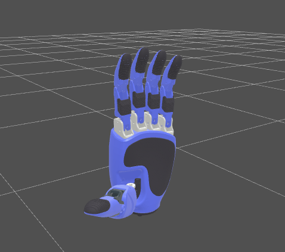
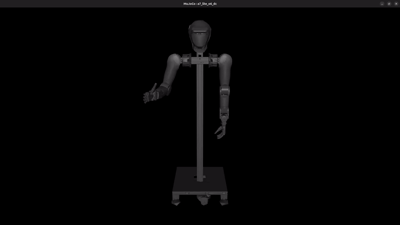

# Workstation 仿真

[English](README.md) · [中文](README.zh.md)

面向 AR5 / P7 / A7-lite 机械臂搭配 Linkerhand L6 / O6 / L25 / L30
的双臂强化学习仿真工作区，运行于 MuJoCo 仿真环境，并支持真机遥测回放。

<table>
  <tr>
    <td></td>
    <td></td>
  </tr>
</table>

## 仓库内容

- 由 composer 驱动的 workstation 资产（recipe → URDF + MJCF + manifest）。
- 运行时主干（`scripts/run.py`），可在 MuJoCo 上运行任何已合成的
  workstation，控制器、任务、录制器都可切换。
- 真机遥测回放器（`scripts/replay.py`）。
- 资产流水线的校验器、注册表工具，以及 CI 漂移守门。

## 工程布局

本仓库是一个 `uv` workspace，`packages/` 下有两个成员：

- `packages/linker-robot-assets/` — 资产 + composer + 校验器。
  - `src/linker_robot_assets/assets/components/{arms,bases,hands}/` —
    可复用的子组件（URDF + MJCF + meshes + `meta.yaml`）。
  - `src/linker_robot_assets/assets/workstations/<name>/` —
    `recipe.yaml`，以及生成产物 `workstation.{urdf,mjcf}` 与
    `manifest.yaml`。
  - `src/linker_robot_assets/composer/` — recipe → URDF/MJCF/manifest。
  - `src/linker_robot_assets/ci/check_drift.sh` — composer 漂移守门。
- `packages/linker-sim/` — 仿真运行时（依赖 `linker-robot-assets`）。
  - `src/linker_sim/backends/mujoco/` — MuJoCo 后端实现。
  - `src/linker_sim/controllers/` — `joint_pd`、`osc`、`ik`。
  - `src/linker_sim/tasks/` — 任务定义。
  - `src/linker_sim/configs/` — Hydra 配置（`pkg://linker_sim.configs`）。

顶层入口和辅助目录：

- `scripts/run.py` / `scripts/replay.py` — Hydra 入口。
- `tests/` — 使用合成 fixture 的 pytest 套件。
- `docs/` — 架构、安装、使用、资产与 MJCF 编写指南。

## 安装

详见 [docs/installation.md](docs/installation.md)。MuJoCo-only
（Python 3.11 或 3.12，无需 GPU）— 用于回放、强化学习和数据采集流程。

快速安装：

```bash
python3 -m venv .venv-mujoco && source .venv-mujoco/bin/activate
pip install -e packages/linker-robot-assets -e packages/linker-sim[mujoco]
```

> **仅源码 checkout 安装。** 必须使用 editable 安装（`pip install -e`）。
> Composer 资产、Hydra 配置以及 `scripts/` 入口均从源码树解析，
> 而非来自 package data。**不**支持构建并分发 wheel。

## 快速上手

安装完成后做一次 smoke test：

```bash
python scripts/run.py max_steps=200 headless=true
```

其余内容（MuJoCo、回放、增益调参、合成新 workstation、录制 episode 等）
请见 [docs/USAGE.zh.md](docs/USAGE.zh.md)
（[English](docs/USAGE.md)）。

### 浏览器可视化

浏览器回放可视化（WebGL，无需 GPU）现已迁移到独立仓库
[`linker-sim-viser`](https://gitea.linkerhub.work/LinkerOS/linker-sim-viser)，
该仓库以本仓库的 `linker-robot-assets` 包作为机器人资产的唯一数据源。

参见 [docs/known_limitations.md](docs/known_limitations.md)，
其中记录了手部解码器线性拟合的注意事项以及 UMI-Dex 路径 hack 的 TODO。

## 开发者注意事项

- 不要把生成产物（`__pycache__`、虚拟环境、日志等）提交到 git；
  但 workstation 的合成产物（`workstation.urdf`、`workstation.mjcf`、
  `manifest.yaml`）**是**需要提交的。
- 将开发分支单独维护，切换分支前先提交。
